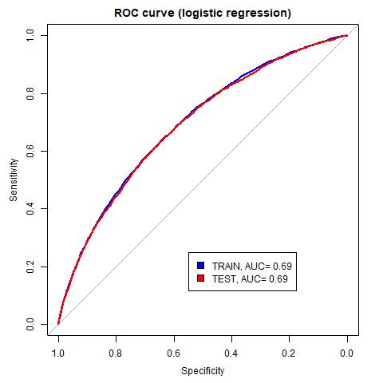
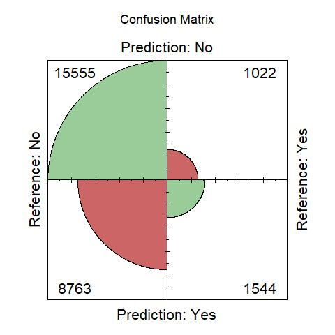
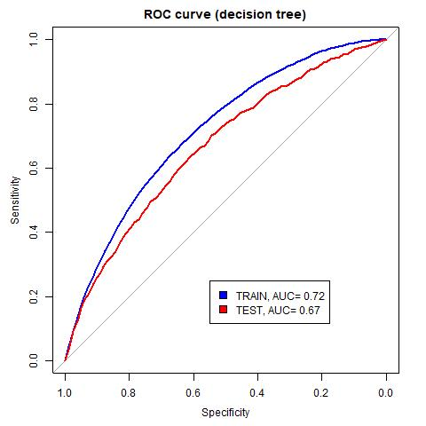
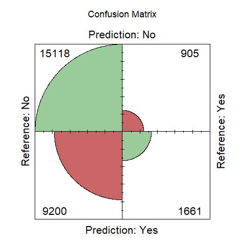
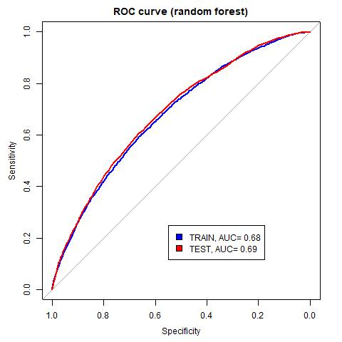
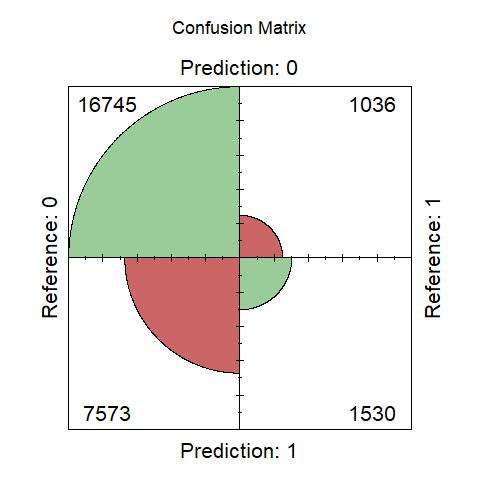
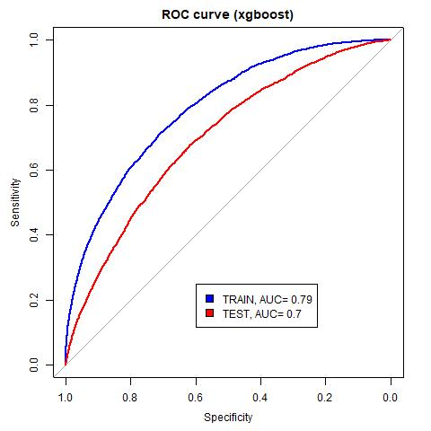

<style type="text/css">
body{
text-align: justify
}
h1.title {
  font-size: 28px;
  text-align: center;
}
h4.author { /* Header 4 - and the author and data headers use this too  */
    font-size: 18px;
  font-family: "Times New Roman", Times, serif;
  text-align: center;
}
</style>

```{r setup, include=FALSE}
knitr::opts_chunk$set(echo = FALSE)
```

# Introduction

The project was prepared for Machine Learning 2 classes. It covers the topic of classification methods on big datasets (at least 1 million cells in the dataset). Here, we used a commonly available data from kaggle to estimate a few chosen models: logistic regression (econometric model for benchmark), single decision tree, random forest, extreme gradient boosting (machine learning models). 

AUC measure was used for measuring the models' performance. The data were devided into train and test subsets with relation 60:40. Stratified sampling was applied here. Considering the educational character of the project, the grid search algorithms for random forest and xgboost were prepared manually. It makes the calculations more trustful cause all the main steps were supervised. They used 5-folds-cross-validation.

The aim of the analysis was to choose a model which results would be at least satisfactory. The next step was trying to investigate the predictions using explainable machine learning methods. The well-established DALEX package was implemented. It enabled drawing Accumulated Local Effects Plots which clearly demonstrate what is the relationship between a certain variable and the dependent one.

Obviously, during preparing the project, some drawbacks were met. In this report, they were briefly described as solutions were suggested for further analysis.

# Description of the data

The dataset was once used for a kaggle contest. It was downloaded for the purposes of the project from: https://www.kaggle.com/c/DontGetKicked/overview. The variables describe different sold cars' characteristics as well as some features of auction. All of them were shortly described below.

Dependent variable:

- IsBadBuy - 0 means that the bought car was a good buy (was not 'kicked'/crashed before), 1 means the opposite - bought car was a bad buy ('kicked'/crashed before).

Independent variables:

- AUCGUART – the guarantee level provided by the auction for the vehicle,
- Auction – name of the dealer,
- BYRNO - the ID associated with each buyer,
- Color – color of the vehicle,
- IsOnlineSale - whether the car was sold online or not,
- Make – the company that made the vehicle,
- MMRAcquisitionAuctionAveragePrice – acquisition price for this vehicle in average condition during purchase,
- MMRAcquisitionAuctionCleanPrice - acquisition price for this vehicle in the above average condition during purchase,
- MMRAcquisitionRetailAveragePrice - acquisition price for this vehicle in retail market in average condition,
- MMRAcquisitonRetailCleanPrice - acquisition price for this vehicle in above average condition in the retail market,
- MMRCurrentAuctionAveragePrice – the current auction price for this vehicle in average condition,
- MMRCurrentAuctionCleanPrice – the current auction price of this vehicle in above average condition,
- MMRCurrentRetailAveragePrice - The current retail price for this vehicle in average condition,
- MMRCurrentRetailCleanPrice – the current retail price for this vehicle in above average condition,
- Model – subclass from each Make level,
- Month - variable created basing on PurchDate.1 feature, describes the month of auction,
- Nationality – where the vehicle was made,
- PRIMEUNIT – identify if the vehicle would have a higher demand than the standard purchase,
- PurchDate – exact date of purchase (coded as number),
- PurchDate.1 – exact date of pruchase (in date format),
- Size – describes size of vehicle,
- SubModel – type of model,
- TopThreeAmericanName – the original parent company that owns the Make,
- Transmission – AUTO or MANUAL,
- Trim – the class distinction in each mode,
- VehBCost – the initial base price for the vehicle at beginning of auction,
- VehicleAge – number of years the vehicle has been used (not necessarly the same as VehYear),
- VEhOdo – number of miles driven before purchase,
- VehYear – the year to which a particular model belongs,
- VNST – the state where the car was purchased,
- VNZIP1 - the zip code where the car was purchased,
- WarrantyCost - the cost of warranty for each vehicle,
- WheelType – type of wheel (in fact the same as WheelTypeID),
- WheelTypeID – ID of different types of wheel.

The dataset consisted of 72 983 observations. At first, there were 34 variables.

```{r, include=TRUE, echo=TRUE, warnings=FALSE, message=FALSE, fig.keep = 'last'}

#turns off warnings (nicer output in html needed)
options(warn = -1)

#sets English language
Sys.setenv(LANG = "en")

#sets proper directory
setwd("C:\\Users\\Maciek\\Desktop\\classification\\markdown")

#installs and loads into memory all the needed packages
source("C:\\Users\\Maciek\\Desktop\\classification\\codes\\TECHNICALS_25.12.R")

#loads the dataset
data <- read_delim("C:\\Users\\Maciek\\Desktop\\classification\\data\\kick2.csv",delim=';')
data <- as.data.frame(data)

#recoding missings from '?' to 'NA'
data[data=='?'] = NA

```

# Exploratory data analyses

Before anvanced analysis, a basic data exploration was conducted in aim of identifying potential problems with variables, especially missing values and mistakes. Waffle plots were used for identifying the first. If any mistakes in the continuous variables occured, density plots should clearly demonstrate them. In case of categorical variables, modified waffle plots were implemented for the same purpose. Some analysis - conditional density plots and stacked barplots - were used for identifying the variables that strongly differ the cars. Finally, proper correlation measures were calculated for both continuous and categorical variables to catch the similarities.

## Missing values

First of all, all the variables were tested for the presence of missing values. For visualisation a well-established waffle plots were used. Each cell in a plot ia an equivalent of 1% of the particular variable's values. Red color means that a certain share of such values is missing.

For cleaning the dataset, some more or less automatic data cleaning functions were used. The columns with share of missings above 50% were removed. Rows with more than 25% of missings were also deleted. Variables were recoded for numeric and continuous depending of the amounts of unique value in each column. It was assumed that if there was more than a certain number of unique values, then the variable should be treated as continuous. As an implication, in further analysis such variables as month of the auction, car age, year of production were presented as continuous. Considering the factors, they were mapped - least frequent levels (less than 1% of share) were made a one level called 'other'. Another assumption was that there cannot be more than 15 levels of a factor.

```{r, warnings=TRUE, message=TRUE, fig.width=15, fig.height=12, fig.keep = 'all', results='asis'}

#loads the function plotting missing values' share using a=waffle plots
source("C:\\Users\\Maciek\\Desktop\\classification\\codes\\WAFFLE_PLOT_26.12.R")

#prepares such plots for each variable
gs=list()
for(i in c(3:ncol(data))){
  plot = waffle_plot(data,i)
  gs = list.append(gs,plot)
}

#prepares layout for combining plots
lay <- rbind(
  c(1,2,3,4,5,6,7,8),
  c(9,10,11,12,13,14,15,16),
  c(17,18,19,20,21,22,23,24),
  c(25,26,27,28,29,30,31,32)
  )
  
#plotting waffle plots
grid.arrange(grobs = gs, layout_matrix = lay)
  
```

It seems that two variables - PRIMEUNIT, AUCGUART - consists mostly of missings (95% share). Obviously, they were not used for further analysis.

```{r, include=TRUE, echo=TRUE, warnings=FALSE, message=FALSE, fig.keep = 'last'}

#prepares dataset for further analysis
source("C:\\Users\\Maciek\\Desktop\\classification\\codes\\DATA_PREPARATION_26.12.R")
data_final <- data_preparation(data)

#removing not needed columns
data_final <- data_final[,-c(2,3)]

#recodes the dependent variable levels' labels
levels(data_final$IsBadBuy) <- c("No","Yes")

#saves list of continuous variable's names
continuous_variables <- c(
  "VehOdo","MMRAcquisitionAuctionAveragePrice","MMRAcquisitionAuctionCleanPrice",
  "MMRAcquisitionRetailAveragePrice","MMRAcquisitonRetailCleanPrice",
  "MMRCurrentAuctionAveragePrice","MMRCurrentAuctionCleanPrice",
  "MMRCurrentRetailAveragePrice","MMRCurrentRetailCleanPrice",
  "BYRNO","VNZIP1","VehBCost","WarrantyCost","VehYear","VehicleAge"
)

#saves list of categorical variable's names
categorical_variables <- c(
  "Auction","Make","Model","Trim","SubModel","Color","Transmission",
  "WheelTypeID","WheelType","Nationality","Size","TopThreeAmericanName","VNST",
  "IsOnlineSale","Month"
)

```

```{r, include=TRUE, echo=TRUE, warnings=FALSE, message=FALSE, fig.width=15, fig.height=12, fig.keep = 'all', results='asis'}

#loads functions needed for creating plots of different kinds
source("C:\\Users\\Maciek\\Desktop\\classification\\codes\\HISTOGRAM_27.12.R")
source("C:\\Users\\Maciek\\Desktop\\classification\\codes\\CONDITIONAL_DENSITY_PLOT_27.12.R")
source("C:\\Users\\Maciek\\Desktop\\classification\\codes\\FACTORS_LEVELS_27.12.R")
source("C:\\Users\\Maciek\\Desktop\\classification\\codes\\STACKED_BARPLOT_27.12.R")

#prepares lists for storing the plots
histograms_list = list()
conditional_densities_list = list()
factors_levels_list = list()
stacked_barplots_list = list()

#the loop runs on every variable and creates plots considering if the variable is continuous or categorical
for(i in c(2:ncol(data_final))){
  
  #plots for continuous variables
  if(class(data_final[,i])=="numeric"){
    
    #prepares histogram
    histogram<-nice_histogram(data_final,i)
    histograms_list = list.append(histograms_list,histogram)
    
    #prepares conditional density plot for numeric variables
    conditional_density_plot <- conditional_density(data_final,i)
    conditional_densities_list = list.append(conditional_densities_list, conditional_density_plot)
  }
  
  #plots for categorical variables
  if(class(data_final[,i])=="factor"){
    
    #prepares table with shares of factor's levels
    factors_levels_plotted = factors_levels(data_final,i)
    factors_levels_list = list.append(factors_levels_list, factors_levels_plotted)
    
    #prepares stacked barplot
    stacked_barplot_done = stacked_barplot(data_final,i)
    stacked_barplots_list = list.append(stacked_barplots_list,stacked_barplot_done)
  }
}

```

## The dependent variable

The dependent variable was initially checked for shares of levels. As it was presented below, about 10% of observations were bad buys (the cars were 'kicked').

```{r, include=TRUE, echo=TRUE, warnings=FALSE, message=FALSE, fig.width=8, fig.height=5, fig.keep = 'all', results='asis'}

#prepares table with shares of factor's levels in the dependent variable
factors_levels(data_final,1)

```

## Continuous variables

The first step in analysing the continuous variables was deisplaying their distributions. The initial conclusions were that some of the are strongly correlated. In most cases it was an obvious outcome - VehYear had a mirror distribution in comparison to VehicleAge. All the variables describing different prices (retal, clean etc.) seemed to be almost identhical. Some doubts were sparked by BYRNO variable (many outliers observed).

```{r, include=TRUE, echo=TRUE, warnings=FALSE, message=FALSE, fig.width=15, fig.height=12, fig.keep = 'all', results='asis'}

#prepares layout for plots
lay <- rbind(
  c(1,2,3,4),
  c(5,6,7,8),
  c(9,10,11,12),
  c(13,14,15,NA)
  )
  
#plots prepared histograms
grid.arrange(grobs = histograms_list, layout_matrix = lay)
```

In aim of confirming the observed dependencies, pearson correlation measure was calculated for the continuous variables. The corrplot clearly demonstrated the strong correlation between all the variables describing the price. The VehYear and VehicleAge were confirmed to be identhical. It was observed that VehBCost is also strongly correlated with the price variables. So is the age.

```{r, include=TRUE, echo=TRUE, warnings=FALSE, message=FALSE, fig.width=15, fig.height=12, fig.keep = 'all', results='asis'}

#loads function for correlations' analyses
source('C:\\Users\\Maciek\\Desktop\\classification\\codes\\correlations_11.12.R')

#runs pearson for continuous variables and plots corrplot
correlations(data_final,continuous_variables,1)

```

Looking for the variables that strongly differ the 'kicked' and 'not kicked' cars, conditional density plots were displayed. The ones that were very similiar to each other were not showed here for obvious reasons.

```{r, include=TRUE, echo=TRUE, warnings=FALSE, message=FALSE, fig.width=15, fig.height=12, fig.keep = 'all', results='asis'}

#takes only the interesting ones from continuous variables
#plotting all at once would make the raport messy
conditional_densities_list = conditional_densities_list[c(2,3,4,12:15)]

#prepares layout
lay <- rbind(
  c(1,2),
  c(3,4),
  c(5,6),
  c(7,NA)
  )
  
#plots conditional densities
grid.arrange(grobs = conditional_densities_list, layout_matrix = lay)
```

It seems that VehicleAge should be named as a potentially good predictor of the analysed phenomena. The older the car, the less amount of 'not kicked' ones. Asymmetrical conditional distributions of the price variable (here represented by MMRAcquisitionAuctionAveragePrice) suggest that it can be a good predictor too. As well as VehBCost (no surprise cause they are stronly correlated). VehOdo and WarrantyCost look more or less similiar to the ones described above. VNZIP1 can be consider too cause the distributions are not the same. BYRNO seems to be least probable of being a good predictor. Another important observation is that the outliers occur but should not have a very strong impact on further analysis.

## Categorical variables

Analyses of the categorical variables was started from displaying the shares of the factors' levels. It appeared that variable called Model has multiple levels, many of which with share less than 1%. They were mapped into one single level. It can be perceived as problematic. On the other hand the most frequent levels were still used for analyses in an unchangable form. Very similiar is the situation with variable SubModel (strong correlation possible). WheelTypeID and WheelType looks identhical - it assures that they carry the same information.

```{r, include=TRUE, echo=TRUE, warnings=FALSE, message=FALSE, fig.width=15, fig.height=15, fig.keep = 'all', results='asis'}

#prepares layout
lay <- rbind(
  c(1,2,3),
  c(4,5,6),
  c(7,8,9),
  c(10,11,12),
  c(13,14,15)
  )
  
#plots waffle plots with factor levels
grid.arrange(grobs = factors_levels_list, layout_matrix = lay)

```

As well as the categorical variables are mostly not ordinal, for checking the correlation between them, Goodman/Kruskal lambda was calculated. Surprisingly, Model and SubModel are not so strongly correlated. WheelType and WheelTypeID were confirmed to be the same. TopThreeAmericanName was reported to be stronly correlated with Make variable. It makes sense because both variables inform if the car was Ford, GM and Chrysler.

```{r, include=TRUE, echo=TRUE, warnings=FALSE, message=FALSE, fig.width=15, fig.height=12, fig.keep = 'all', results='asis'}

#calculates goodman/kruskal lambda correlation measure for categorical variables, also prepares corrplot
correlations(data_final,categorical_variables,0)
```

At the end of initial analyses, stacked barplots for categorical variables were plotted. They are commonly known of being very informative cause they carry both the information about levels shares but also demonstrate how each level differs the another variable. Considering the raport capacity, only the most interesting ones were displayed below.

Firstly, the factors that seem to strongly differ the phenomena were presented. The more the share of 'kicked' cars vary among levels, the more probable is that this variable will be a good predictor. It can be observed that level MANHEIM in variable Auction has relatively bigger share of kicked cars. This variable should be important in models. Looks like Special WheelType also suggests that the car was crashed at least once. Share of 'kicked' ones among levels in Trim varies from 12.5% to even 27.4%. In VNST it is between 9.5% and 22.3%. Differences in Make are a bit less considerable. There are relatively strong variations in Size. COMPACT cars were 'kicked' in 22.4% in comparison to only 13.2% of LARGE. In SubModel the variation can also be observed easily.

```{r, include=TRUE, echo=TRUE, warnings=FALSE, message=FALSE, fig.width=15, fig.height=20, fig.keep = 'all', results='asis'}

#chooses only the most interesting barplots
#plotting all of them would make the visualization useless
stacked_barplots_list1 = stacked_barplots_list[c(1,9,2,4,5,11,13)]

#prepares layout
lay <- rbind(
  c(1,2),
  c(4,7),
  c(3,3),
  c(6,6),
  c(5,5)
  )
  
#plots stacked barplots
grid.arrange(grobs = stacked_barplots_list1, layout_matrix = lay)

```

Some factors seem to have rather constant share of 'kicked' cars among their levels. Looks like Color does not have an impact on being 'kicked'. Same with Nationality and Month of the auction.

```{r, include=TRUE, echo=TRUE, warnings=FALSE, message=FALSE, fig.width=15, fig.height=20, fig.keep = 'all', results='asis'}

#chooses some variables that will rather not have a significant impact on the dependent variables
stacked_barplots_list2 = stacked_barplots_list[c(10,6,15)]

#prepares layout
lay <- rbind(
  c(10),
  c(6),
  c(15)
  )
  
#plots chosen stacked barplots
grid.arrange(grobs = stacked_barplots_list2, layout_matrix = lay)

```

# Modelling

A few models were estimated in aim of finding a good one for prediction of a 'kicked' car. Some of them were estimated just for a benchmark (logistic regression, single decision tree) whereas the others were rather serious candidates for being the final model (random forest, xgboost).

Each model were trained on a training subset which was 60% of dataset chosen using stratified sampling. If it was reasonable, the performance on train subset was measured after running 5 folds-cross-validation. After that, it was compared with results on test subset. For measuring the quality of the model ROC AUC was used.

## Logistic regression

Logistic regression is often estimated when it comes to estimating credit risk. It is also commonly used as a benchmark for advanced machine learning models to show their supremacy.

The variables were one-hot-encoded before running the model. What is more, the variables were chosen considering correlations plotted before - the strongly correlated ones were not used. Each encoded factor was used in a model with one level ommited due to collinearity. The logistic regression assumptions were not tested cause it was not the aim of the project.

Finally, the results obtained for test subset are as follows: **ACCURACY: 0.64, SENSITIVITY: 0.64, SPECIFICITY: 0.64** which was visualised using fourfoldplot (see below).

```{r, include=TRUE, echo=TRUE, warnings=FALSE, message=FALSE, fig.width=15, fig.height=20, fig.keep = 'all', results='asis'}

#turns off warnings (nicer output in html needed)
options(warn = -1)

#changes IsBadBuy's levels for "No", "Yes"
levels(data_final$IsBadBuy) <- c("No","Yes")

#does one-hot-encoding (creating dummies)
data_final_ohe <- as.data.frame(one_hot(as.data.table(data_final)))

#removing first column with dependent variable
data_final_ohe <- data_final_ohe[,-1]

#divides data set into training and testing sample 
set.seed(372532)
training_obs <- createDataPartition(data_final_ohe$IsBadBuy_Yes, 
                                    p = 0.6, #assuming train = 60%
                                    list = FALSE)
train_data <- data_final_ohe[training_obs,]
test_data  <- data_final_ohe[-training_obs,]

#declares the formula of the model
model_formula <- IsBadBuy_Yes ~ 
  
  #removing Auction_OTHER (collinearity)
  Auction_ADESA + Auction_MANHEIM +
  
  #removing VehYear (strong correlation with VehicleAge)
  VehicleAge + 
  
  #removing Make_other (collinearity)
  Make_CHEVROLET + Make_CHRYSLER + 
  Make_DODGE + Make_FORD + Make_HYUNDAI + Make_JEEP + Make_KIA + 
  Make_NISSAN + Make_PONTIAC + 
  Make_SATURN + Make_SUZUKI + 
  
  #removing Model_other (collinearity)
  Model_1500_RAM_PICKUP_2WD + Model_CALIBER + Model_CARAVAN_GRAND_FWD_V6 +
  Model_COBALT + Model_IMPALA + Model_MALIBU_4C + Model_PT_CRUISER + 
  Model_PT_CRUISER_2_4L_I4_S + Model_SEBRING_4C + Model_TAURUS + Model_TAURUS_3_0L_V6_EFI +
  
  #removing Trim_other (collinearity)
  Trim_Bas + Trim_EX + 
  Trim_LS + Trim_LT + Trim_LX + Trim_SE + 
  Trim_SEL + Trim_SXT + Trim_Tou + Trim_XLT + 
  
  #removing SubModel_other (collinearity)
  SubModel_other + SubModel_2D_COUPE +
  SubModel_4D_SEDAN + SubModel_4D_SEDAN_EX +
  SubModel_4D_SEDAN_LS + SubModel_4D_SEDAN_LT + 
  SubModel_4D_SEDAN_LX + SubModel_4D_SEDAN_SE + 
  SubModel_4D_SEDAN_SXT_FFV + SubModel_4D_SUV_4_2L_LS +
  SubModel_4D_WAGON + SubModel_MINIVAN_3_3L +
  
  #removing Color_other (collinearity)
  Color_BEIGE + Color_WHITE + 
  Color_BLACK + Color_BLUE + Color_GOLD + Color_GREEN + 
  Color_GREY + Color_MAROON + Color_RED + Color_SILVER +
  
  #removing Transmission_other (collinearity)
  Transmission_AUTO + Transmission_MANUAL + 
  
  #removing WheelTypeIDs (correlated with WheelTypes)
  #removing WheelType_Special (collinearity)
  WheelType_Alloy + WheelType_Covers +
  
  VehOdo + 
  
  #removing Nationality_other (collinearity)
  Nationality_AMERICAN + Nationality_OTHER_ASIAN + 
  Nationality_TOP_LINE_ASIAN + 
  
  #removing Size_other (collinearity)
  Size_CROSSOVER + Size_COMPACT +
  Size_LARGE + Size_LARGE_SUV + Size_LARGE_TRUCK + Size_MEDIUM + 
  Size_MEDIUM_SUV + Size_SMALL_SUV + Size_SMALL_TRUCK + Size_SPECIALTY + 
  Size_SPORTS + Size_VAN + 
  
  #removing all TopThreeAmericanName variables (strong correlation with Make variables)

  #removing following variables (strong correlation with
  #MMRAcquisitionAuctionAveragePrice):
  #MMRAcquisitionAuctionCleanPrice, MMRAcquisitionRetailAveragePrice,
  #MMRAcquisitonRetailCleanPrice, MMRCurrentAuctionAveragePrice,
  #MMRCurrentAuctionCleanPrice, MMRCurrentRetailAveragePrice,
  #MMRCurrentRetailCleanPrice
  MMRAcquisitionAuctionAveragePrice +  
  
  BYRNO + 
  
  #removing VNST_other (collinearity)
  VNST_AZ + VNST_CA + VNST_CO + 
  VNST_FL + VNST_GA + VNST_NC + VNST_OK +
  VNST_SC + VNST_TN + VNST_TX + VNST_VA + 
  
  VehBCost + 
  
  #removing IsOnlineSale_0 (collinearity)
  IsOnlineSale_1 + 
  
  WarrantyCost + 
  
  #removing Month_1 (collinearity)
  Month_2 + Month_3 + Month_4 + Month_5 + Month_6 + Month_7 + 
  Month_8 + Month_9 + Month_10 + Month_11 + Month_12

#LOGISTIC REGRESSION

#regression on the chosen variables
logit1 <- lm(model_formula, data = train_data)

#calculates score on TRAIN subset
probabilities_train <- logit1 %>% predict(train_data, type = "response")
predicted_classes_train <- ifelse(probabilities_train > 0.5, 1, 0)
roc_train <- roc(predictor = probabilities_train, response = train_data$IsBadBuy_Yes)

#finds threshold which solves the following problem: min{sensitivity, specificity}
#it was applied to make the confusion matrix more reasonable
min_diff = 1
optim_threshold = NA
for(i in c(1:length(roc_train$sensitivities))){
  diff = abs(roc_train$sensitivities[i]-roc_train$specificities[i])
  if(diff < min_diff){
    min_diff = diff
    optim_threshold = roc_train$thresholds[i]
  }
}

#prediction using found threshold
predicted_classes_train <- ifelse(probabilities_train > optim_threshold, 1, 0)
roc_train <- roc(predictor = probabilities_train, response = train_data$IsBadBuy_Yes)

#prepares confusion matrix on TRAIN subset
table_train <- confusionMatrix(as.factor(predicted_classes_train),
                               as.factor(train_data$IsBadBuy_Yes))

#calculates score on TEST subset
probabilities_test <- logit1 %>% predict(test_data, type = "response")
predicted_classes_test <- ifelse(probabilities_test > optim_threshold, 1, 0)
roc_test <- roc(predictor = probabilities_test, response = test_data$IsBadBuy_Yes)

#prepares confusion matrix on TEST subset
table_test <- confusionMatrix(as.factor(predicted_classes_test),
                              as.factor(test_data$IsBadBuy_Yes))

#saves confusion matrix using fourfoldplot
jpeg('cm_logit.jpg')
fourfoldplot(table_test$table, color = c("#CC6666", "#99CC99"), std='all.max',
             conf.level = 0, margin = 1, main = "Confusion Matrix")
dev.off()

#saves ROC curve
jpeg('roc_logit.jpg')
plot(roc_train, main="ROC curve (logistic regression)", col="blue")
lines(roc_test, col="red")
legend(0.55,0.25,c(paste("TRAIN, AUC=",round(auc(roc_train),2)),
                  paste("TEST, AUC=",round(auc(roc_test),2))),
       fill=c("blue","red"))
dev.off()

```

<center>  </center>
<center>  </center>

The logistic regression model seems to be noticeably stable - train and test AUC metrics are close to each other. It could be assumed that such model is a good benchmark for comparing it with the more sophisticated ones. Normalization of the variables could make the results even better. However preparing the best possible logistic regression model is not the aim of the raport. Therefore, it was neglected.

## Single decision tree

Another estimated model was a single decision tree. Considering the idea of it, the data did not require to be one-hot-encoded. Moreover, correlations should not be an obstacle when it comes to estimating such model. The model should be perceived as an initial version of far more complicated machine learning models.

The stopping criteria were chosen reasonably considering well-established good practices. Parameters minsplit and minbucket should be respectively ~2% and ~1% of training subset and were specified following this rule. The initial maxdepth of tree was left default 30.

For such tree, the results obtained for test subset are as follows: **ACCURACY: 0.64, SENSITIVITY: 0.64, SPECIFICITY: 0.60**. These results combined with AUC metric's values on test subset suggest that single decision tree performs a bit worse than logistic regression.

```{r, include=TRUE, echo=TRUE, warnings=FALSE, message=FALSE, fig.width=15, fig.height=20, fig.keep = 'all', results='asis'}

#turns off warnings (nicer output in html needed)
options(warn = -1)

#divides data set into training and testing sample
#need to be done again since the logistic regression uses one-hot-encoded variables
set.seed(372532)
training_obs <- createDataPartition(data_final$IsBadBuy,
                                    p = 0.6, 
                                    list = FALSE) 
train_data <- data_final[training_obs,]
test_data  <- data_final[-training_obs,]

#the formula of the model
model_formula <- IsBadBuy ~ .

#SINGLE CLASSIFICATION TREE (NOT PRUNED)
tree1 <- rpart(model_formula,
               data = train_data,
               method = "class",
               control=rpart.control(
                 minsplit = 870,
                 minbucket = 435,
                 cp = -1,
                 xcal=10,
                 maxdepth = 30
                 ))

#prints cp (checking if tree can be prunned)
#printcp(tree1)

#calculates score on TRAIN subset
probabilities_train <- as.numeric(rpart.predict(tree1, train_data)[,2])
predicted_classes_train <- ifelse(probabilities_train > 0.5, 1, 0)
roc_train <- roc(predictor = probabilities_train, response = train_data$IsBadBuy)

#finds threshold which solves the following problem: min{sensitivity, specificity}
#it was applied to make the confusion matrix more reasonable
min_diff = 1
optim_threshold = NA
for(i in c(1:length(roc_train$sensitivities))){
  diff = abs(roc_train$sensitivities[i]-roc_train$specificities[i])
  if(diff < min_diff){
    min_diff = diff
    optim_threshold = roc_train$thresholds[i]
  }
}

#prediction using found threshold
predicted_classes_train <- ifelse(probabilities_train > optim_threshold, "Yes", "No")
roc_train <- roc(predictor = probabilities_train, response = train_data$IsBadBuy)

#prepares confusion matrix on TRAIN subset
table_train <- confusionMatrix(as.factor(predicted_classes_train),
                               train_data$IsBadBuy)

#calculates score on TEST subset
probabilities_test <- as.numeric(rpart.predict(tree1, test_data)[,2])
predicted_classes_test <- ifelse(probabilities_test > optim_threshold, "Yes", "No")
roc_test <- roc(predictor = probabilities_test, response = test_data$IsBadBuy)

#prepares confusion matrix on TEST subset
table_test <- confusionMatrix(as.factor(predicted_classes_test),
                              test_data$IsBadBuy)

#saves confusion matrix visualised using fourfoldplot
jpeg('cm_dt_notPrunned.jpg')
fourfoldplot(table_test$table, color = c("#CC6666", "#99CC99"), std='all.max',
             conf.level = 0, margin = 1, main = "Confusion Matrix")
dev.off()

#saves ROC curve
jpeg('roc_dt_notPrunned.jpg')
plot(roc_train, main="ROC curve (decision tree)", col="blue")
lines(roc_test, col="red")
legend(0.55,0.25,c(paste("TRAIN, AUC=",round(auc(roc_train),2)),
                   paste("TEST, AUC=",round(auc(roc_test),2))),
       fill=c("blue","red"))
dev.off()

```

<center>  </center>
<center>  </center>

Such tree was tried to be prunned. However, errors estimated using rpart function were rather stable. Moreover, with cp parameter equal 0, number of splits was already 0. Moreover, considering the fact that we were looking for the best possible model in terms of prediction, prunning seems to be not very useful. It would rather make the performance worse.

## Random forest

Next, random forest model was estimated. Cross validation on 5 folds was used for estimating models with different mtry and ntree parameters' values. The optimal mtry parameter happened to be 3, since ntree was 300.

The results were as follows: **ACCURACY: 0.62, SENSITIVITY: 0.62, SPECIFICITY: 0.65**. Surprisingly, random forest happened to be worse than logistic regression. What is more, the ROC curve seemed to show the overfitting problem that could not be solved using restrictions like specification of maximal number of nodes.

```{r, include=TRUE, echo=TRUE, warnings=FALSE, message=FALSE, fig.width=15, fig.height=20, fig.keep = 'all', results='asis'}

#turns off warnings (nicer output in html needed)
options(warn = -1)

#RANDOM FOREST
#runs model on optimal parameters
set.seed(372332)
rf_model1 <- randomForest(model_formula,
                          data=train_data,
                          ntree=300,
                          mtry=3,
                          importance=TRUE
                          )

#calculates score on TRAIN subset
probabilities_train <- as.numeric(predict(rf_model1, type = "prob")[,2])
predicted_classes_train <- ifelse(probabilities_train > 0.5, 1, 0)
roc_train <- roc(predictor = probabilities_train, response = train_data$IsBadBuy)

#finds threshold which solves the following problem: min{sensitivity, specificity}
#it was applied to make the confusion matrix more reasonable
min_diff = 1
optim_threshold = NA
for(i in c(1:length(roc_train$sensitivities))){
  diff = abs(roc_train$sensitivities[i]-roc_train$specificities[i])
  if(diff < min_diff){
    min_diff = diff
    optim_threshold = roc_train$thresholds[i]
  }
}

#prediction using found threshold
predicted_classes_train <- ifelse(probabilities_train > optim_threshold, 'Yes', 'No')
roc_train <- roc(predictor = probabilities_train, response = train_data$IsBadBuy)

#prepares confusion matrix on TRAIN subset
table_train <- confusionMatrix(as.factor(predicted_classes_train),
                               train_data$IsBadBuy)

#calculates score on TEST subset
probabilities_test <- as.numeric(predict(rf_model1, test_data, type = "prob")[,2])
predicted_classes_test <- ifelse(probabilities_test > optim_threshold, 'Yes', 'No')
roc_test <- roc(predictor = probabilities_test, response = test_data$IsBadBuy)

#prepares confusion matrix on TEST subset
table_test <- confusionMatrix(as.factor(predicted_classes_test),
                              test_data$IsBadBuy)

#saves confusion martix visualised using fourfoldplot
jpeg('cm_rf.jpg')
fourfoldplot(table_test$table, color = c("#CC6666", "#99CC99"), std='all.max',
             conf.level = 0, margin = 1, main = "Confusion Matrix")
dev.off()

#saves ROC curve
jpeg('roc_rf.jpg')
plot(roc_train, main="ROC curve (random forest)", col="blue")
lines(roc_test, col="red")
legend(0.55,0.25,c(paste("TRAIN, AUC=",round(auc(roc_train),2)),
                  paste("TEST, AUC=",round(auc(roc_test),2))),
       fill=c("blue","red"))
dev.off()

```

<center>  </center>
<center>  </center>

Still, there are papers using the same dataset for making predictions using random forest e.g. https://www.researchgate.net/publication/262523736_Data_Science_with_Kaggles_Competition_Dont_Get_kicked. Such models seem to be even worse than the one estimated by us. The accuracy of them have not reached the level of 60%.

## Extreme gradient boosting

Extreme gradient boosting was also estimated. Grid search was optimalizing AUC measure considering multiple parameters of the model. The results were: **ACCURACY: 0.68, SENSITIVITY: 0.69, SPECIFICITY: 0.60**.

```{r, include=TRUE, echo=TRUE, warnings=FALSE, message=FALSE, fig.width=15, fig.height=20, fig.keep = 'all', results='asis'}

#turns off warnings (nicer output in html needed)
options(warn = -1)

#recodes all the variables to numeric (required for xgboost)
for(i in c(1:ncol(train_data))){
  train_data[,i] = as.numeric(train_data[,i])
  test_data[,i] = as.numeric(test_data[,i])
}

#corrects the dependent variable's values
#recoding it from factor to numeric made it {1,2} instead of {0,1}
train_data[,1] = train_data[,1] - 1
test_data[,1] = test_data[,1] - 1

#saves subsets as metrixes
train_matrix = as.matrix(train_data[,-1])
test_matrix = as.matrix(test_data[,-1])

#saves matrixes as sparse matrixes
train_xgb = xgb.DMatrix(train_matrix, label = train_data$IsBadBuy)
test_xgb = xgb.DMatrix(test_matrix, label = test_data$IsBadBuy)

#list of optimal parameters
param = list(
  max_depth = 5, eta = 0.05, gamma = 0.01, min_child_weight = 0.1,
  max_delta_step = 5, objective = "binary:logistic", eval_metric = "auc"
)

#runs the model on optimized parameters
xgboost_model1 = xgb.train(param, train_xgb, nround = 155)

#calculates score on TRAIN subset
probabilities_train <- predict(xgboost_model1, train_xgb)
predicted_classes_train <- ifelse(probabilities_train > 0.5, 1, 0)
roc_train <- roc(predictor = probabilities_train, response = train_data$IsBadBuy)

#finds threshold which solves the following problem: min{sensitivity, specificity}
#it was applied to make the confusion matrix more reasonable
min_diff = 1
optim_threshold = NA
for(i in c(1:length(roc_train$sensitivities))){
  diff = abs(roc_train$sensitivities[i]-roc_train$specificities[i])
  if(diff < min_diff){
    min_diff = diff
    optim_threshold = roc_train$thresholds[i]
  }
}

#prediction using found threshold
predicted_classes_train <- ifelse(probabilities_train > optim_threshold, 1, 0)
roc_train <- roc(predictor = probabilities_train, response = train_data$IsBadBuy)

#prepares confusion matrix on TRAIN subset
table_train <- confusionMatrix(as.factor(predicted_classes_train),
                               as.factor(train_data$IsBadBuy))

#calculates score on TEST subset
probabilities_test <- predict(xgboost_model1, test_xgb)
predicted_classes_test <- ifelse(probabilities_test > optim_threshold, 1, 0)
roc_test <- roc(predictor = probabilities_test, response = test_data$IsBadBuy)

#prepares confusion matrix on TEST subset
table_test <- confusionMatrix(as.factor(predicted_classes_test),
                              as.factor(test_data$IsBadBuy))

#saves confusion matrix visualised using fourfoldplot
jpeg('cm_xgboost.jpg')
fourfoldplot(table_test$table, color = c("#CC6666", "#99CC99"), std='all.max',
             conf.level = 0, margin = 1, main = "Confusion Matrix")
dev.off()

#saves ROC curve
jpeg('roc_xgboost.jpg')
plot(roc_train, main="ROC curve (xgboost)", col="blue")
lines(roc_test, col="red")
legend(0.6,0.25,c(paste("TRAIN, AUC=",round(auc(roc_train),2)),
                  paste("TEST, AUC=",round(auc(roc_test),2))),
       fill=c("blue","red"))
dev.off()

```

<center>  </center>
<center>  </center>

The performance of our xgboost is rather similiar to neural nets estimated among different papers considering the same data. As far as it is the only one which reached AUC level of 0.7, it can be named the best model so far.

## Investigation of the chosen model's predictions

Basing on the results of estimated models, xgboost should be named the best one. It seems to be quite fairly predictive. Prepared model was used for demonstrating the functionality of well-established DALEX package.

Feature importance illustrates that the model bases mainly on different kinds of price. Maybe, it is not possible to make the model better when we ommit some other information.

```{r, include=TRUE, echo=TRUE, warnings=FALSE, message=FALSE, fig.width=12, fig.height=10, fig.keep = 'all', results='asis'}

#creates an explainer
#source: https://github.com/pbiecek/DALEX_docs/blob/master/vignettes/DALEX_and_xgboost.Rmd
predict_logit <- function(model, x) {
  raw_x <- predict(model, x)
  exp(raw_x)/(1 + exp(raw_x))
}

logit <- function(x) exp(x)/(1+exp(x))

explainer_xgb <- explain(xgboost_model1,
                         data = train_matrix, 
                         y = train_data$IsBadBuy, 
                         predict_function = predict_logit,
                         link = logit,
                         label = "xgboost")

#feature importance
set.seed(123)
vd_xgb <- variable_importance(explainer_xgb, type = "raw")

#ALE plots
xgb_ale1 <- variable_response(explainer_xgb,
                              variable = "VehBCost",
                              type = "ale")

xgb_ale2 <- variable_response(explainer_xgb,
                              variable = "VehicleAge",
                              type = "ale")

xgb_ale3 <- variable_response(explainer_xgb,
                              variable = "Month",
                              type = "ale")

```

```{r, include=TRUE, echo=TRUE, warnings=FALSE, message=FALSE, fig.width=12, fig.height=10, fig.keep = 'all', results='asis'}

#plots feature importance
plot(vd_xgb)

```

What seems to be most interesting, is the relationship between different variables and the score of the model. Here ALE plots were used for visualisation. Their advantage is that contrary to Partial Dependence Plots, they easily deal with highly correlated variables.

```{r, include=TRUE, echo=TRUE, warnings=FALSE, message=FALSE, fig.width=12, fig.height=10, fig.keep = 'all', results='asis'}

#plots prepared ALE plots
plot(xgb_ale1)
plot(xgb_ale2)
plot(xgb_ale3)

```

As the plots demonstrate, the model was capable of predicting a quite obvious relationship between vehicle price and probability of being 'kicked'. In case of warranty cost it also seems to be reasonable. What is interesting, the month of purchasing a car has an impact on the dependent variable in a way that buying one on May, June and July is more risky.

It should be mentioned here that many solutions were tried for improving the models. Multiple new variables were tried as more time features (beginning/end of month, season), different aggregates, variables' transformations. Moreover, resampling algorithm named SMOTE was used too. However, the results have not improved at all.

# Summary

Following report has taken into consideration problem of different classification algorithms' performance. Using commonly available dataset from kaggle.com, four different models were estimated. Their quality was measured using AUC metric. Results were compared to some papers running models on the same data.

It seems that xgboost performs best on the used dataset. However AUC metric was 0.7 which should be perceived at most satisfactory. The model was applied to DALEX package's methods for explanation purposes. Feature importance suggest that only price and age of the vehicle are useful for the prediction. It somehow explains why the performance is not as good as it should be expected.

The relationship between model's score and chosen independent variables seem to be logical. What is interesting, month of the auction seem to have an impact on the probability of purchasing a 'kicked' car.